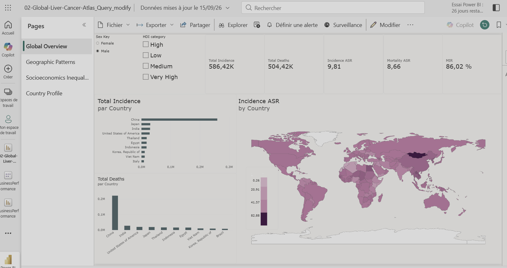
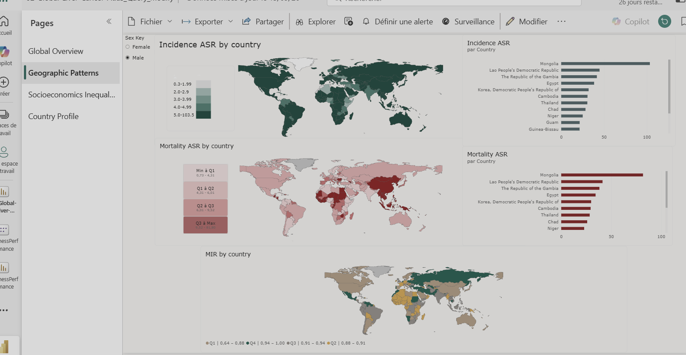
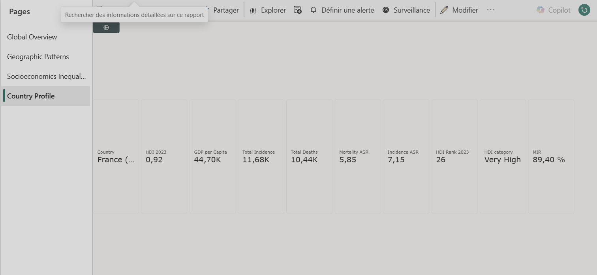

# Global Liver Cancer Atlas — Power BI

Interactive Power BI dashboard exploring the global epidemiology of liver cancer and its relationship with socioeconomic indicators.

The project combines **GLOBOCAN 2024 liver cancer data** with the **UNDP Human Development Index (HDI)** and **World Bank GDP per capita** to investigate geographic and socioeconomic disparities in liver cancer incidence and mortality.

> **Portfolio project — Data Analytics / Health Data / Power BI**

---

## Dashboard

### Global Overview

Overview of global liver cancer incidence, mortality and mortality-to-incidence ratio (MIR), with geographic visualization and country rankings.



### Geographic Patterns

Comparison of incidence, mortality and MIR across countries using interactive world maps and country rankings.



### Socioeconomic Inequalities

Exploration of the relationship between liver cancer indicators and socioeconomic variables such as HDI and GDP per capita.


### Country Profile

Interactive country-level profile with epidemiological and socioeconomic indicators.



---

## Objectives

The dashboard was designed to answer questions such as:

* Which countries have the highest liver cancer incidence?
* Where is liver cancer mortality highest?
* How does the mortality-to-incidence ratio vary geographically?
* Are liver cancer indicators associated with differences in human development?
* How do incidence and mortality vary across socioeconomic contexts?
* How can a country be compared with the global distribution of indicators?

---

## Data

The analysis integrates three main data sources:

| Source                   | Data used                                                            |
| ------------------------ | -------------------------------------------------------------------- |
| **IARC / GLOBOCAN 2024** | Liver and intrahepatic bile duct cancer incidence, mortality and ASR |
| **UNDP**                 | Human Development Index (HDI), 2023                                  |
| **World Bank**           | GDP per capita                                                       |

The GLOBOCAN dataset contains estimates for **186 countries**, separated by **sex**, for incidence and mortality.

### Main epidemiological indicators

* **Incidence cases**
* **Deaths**
* **Incidence ASR** — Age-Standardized Incidence Rate
* **Mortality ASR** — Age-Standardized Mortality Rate
* **MIR** — Mortality-to-Incidence Ratio

---

## Data Model

The Power BI model follows a relational/star-schema-oriented structure:

```text
                    Dim_Country
                         │
                         │
Dim_Sex ─────────── Fact_Cancer ─────────── Dim_Socioeconomic
                         │
                         │
                      Measures
```

### Main tables

* `Fact_Cancer` — epidemiological observations
* `Dim_Country` — country and geographic information
* `Dim_Sex` — sex dimension
* `Dim_Socioeconomic` — HDI and socioeconomic indicators
* `Measure` — DAX measures

The model was designed to separate epidemiological observations from descriptive dimensions and calculated indicators.

---

## Power BI Skills Demonstrated

### Data preparation

* Power Query
* Data cleaning and transformation
* Integration of multiple external datasets
* Country/ISO code matching
* Data type management

### Data modelling

* Relational data model
* Fact and dimension tables
* Relationships between datasets
* Geographic data modelling

### DAX

Examples of calculated indicators include:

```DAX
Total Incidence =
SUM(Fact_Cancer[Incidence Cases])
```

```DAX
Total Deaths =
SUM(Fact_Cancer[Deaths])
```

```DAX
MIR =
DIVIDE([Total Deaths], [Total Incidence])
```

Additional measures are used for ASR indicators, socioeconomic comparisons and country-level analysis.

### Visual analytics

* Interactive KPI cards
* World maps
* Country rankings
* Scatter plots
* Category comparisons
* Key Influencers analysis
* Slicers and cross-filtering
* Drill-through to country profiles

---

## Key Analytical Features

### Geographic analysis

The dashboard allows users to compare countries according to:

* Incidence ASR
* Mortality ASR
* MIR

Different classification approaches are used depending on the indicator and visualization to make geographic differences easier to interpret.

### Socioeconomic analysis

The project explores associations between liver cancer indicators and:

* HDI
* HDI categories
* GDP per capita

Scatter plots and aggregated comparisons are used to investigate population-level patterns.

### Country drill-through

Users can access a dedicated **Country Profile** from the main dashboard to explore the epidemiological and socioeconomic characteristics of an individual country.

---

## Methodological Notes

### Age-standardized rates

Age-standardized rates (ASR) are used to facilitate comparisons between populations with different age structures.

ASR values should **not be summed across countries**. The dashboard therefore uses appropriate aggregation depending on the analytical context.

### Mortality-to-Incidence Ratio

The **MIR** is calculated as:

```text
MIR = Deaths / Incidence
```

It is used here as a **descriptive population-level indicator** to compare the relationship between estimated incidence and mortality across countries.

It should not be interpreted as the probability that an individual diagnosed with liver cancer will die from the disease.

### Sex

The GLOBOCAN dataset used in this project provides estimates for **males and females separately**.

The dashboard therefore uses a sex filter rather than artificially deriving a "Both sexes" ASR by averaging male and female ASRs.

The default dashboard view is set to **Male**.

### Socioeconomic indicators

The epidemiological data and socioeconomic indicators do not necessarily correspond to the exact same reference year. The socioeconomic analyses should therefore be interpreted as **cross-sectional ecological comparisons**, rather than individual-level causal relationships.

---

## Limitations

Several limitations should be considered when interpreting the dashboard:

* GLOBOCAN values are estimates and may differ in quality between countries depending on available cancer-registration data.
* The analysis is performed at the country/population level.
* Associations between socioeconomic indicators and cancer outcomes do not demonstrate individual-level causality.
* Epidemiological and socioeconomic indicators may refer to different reference years.
* MIR is a descriptive ratio and should not be interpreted as an individual survival probability.
* Liver and intrahepatic bile duct cancers are considered together in the GLOBOCAN dataset used here.

---

## Project Structure

```text
02-Global-Liver-Cancer-Atlas/
│
├── README.md
├── 02-Global-Liver-Cancer-Atlas.pbix
│
├── data/
│   ├── raw/
│   └── processed/
│
├── images/
│   ├── Global_Overview.png
│   ├── Geographic_pattern.png
│   ├── Socioeconomic_Inequalities.png
│   ├── Country_profile.png
│   └── Extraction_country_profile.png
│
└── documentation/
    ├── data_sources.md
    ├── methodology.md
    └── data_dictionary.md
```

---

## Tools

* **Power BI**
* **Power Query**
* **DAX**
* **Excel / CSV**
* **Git / GitHub**

---

## Why This Project?

This project combines two areas of interest:

**Health data analysis** and **business intelligence / data visualization**.

The objective was to move beyond a purely technical Power BI exercise and demonstrate how heterogeneous scientific datasets can be transformed into an interactive analytical tool.

The project is also closely related to previous research work on the geographic diversity of liver cancers and global socioeconomic inequalities.
https://pubmed.ncbi.nlm.nih.gov/40452835/
---

## Author

**Fabien Foucher**

Data Scientist / Bioinformatics Scientist
Python · R · Machine Learning · Health Data · Power BI

[GitHub](https://github.com/eurhimante)

---

## Disclaimer

This dashboard is an analytical and educational project based on publicly available data.

It is not intended for clinical decision-making or individual medical assessment.
